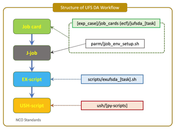

.. _directory-structure:

Directory Structure
===================

The :term:`UFS` DA Workflow follows the vertical directory structure and
environment variable conventions used by :term:`NCEP` Central Operations
(:term:`NCO`) :term:`WCOSS` Implementation Standards. The workflow keeps those
conventions while allowing large working and output files to reside under a
configurable ``PTMP`` location on NOAA :term:`HPC` systems.

.. _nco-standard-variables:

NCO Standard Variables
----------------------

The land-DA workflow uses the following NCO-style variables for its directory
layout and job environment. Variables set by the :term:`job card` provide the
experiment-wide context; variables set by the :term:`J-job <J-jobs>` layer are
derived for each workflow task.

.. list-table:: Standard NCO environment variables
   :header-rows: 1
   :widths: 20 60 20

   * - Name
     - Description
     - Set by
   * - ``COMROOT``
     - ``com`` root directory for input and output data on the current system.
     - Job card
   * - ``DATAROOT``
     - Directory containing job working directories, usually under
       ``OPSROOT/tmp``.
     - Job card
   * - ``DBNROOT``
     - Root directory for data-alerting utilities.
     - Job card
   * - ``DCOMROOT``
     - ``dcom`` root directory.
     - Job card
   * - ``KEEPDATA``
     - ``YES``/``NO`` switch controlling whether the working directory is kept
       after a job completes successfully.
     - Job card
   * - ``MAILTO``
     - Email recipients for job notifications.
     - Job card
   * - ``MAILCC``
     - Email recipients to copy on job notifications.
     - Job card
   * - ``OPSROOT``
     - Operations root directory, for example ``/lfs/$FS/ops/$envir``.
     - Job card
   * - ``PACKAGEROOT``
     - Root installation directory for the application.
     - Job card
   * - ``SENDCOM``
     - ``YES``/``NO`` switch controlling copies to ``COMOUT``.
     - Job card
   * - ``SENDECF``
     - ``YES``/``NO`` switch controlling ``ecflow_client`` child commands.
     - Job card
   * - ``SENDDBN``
     - ``YES``/``NO`` switch controlling whether products are sent off WCOSS2.
     - Job card
   * - ``SENDDBN_NTC``
     - ``YES``/``NO`` switch controlling whether products with WMO headers are
       sent off WCOSS2.
     - Job card
   * - ``SENDWEB``
     - ``YES``/``NO`` switch controlling whether products are sent to a web
       server, often NCORZDM.
     - Job card
   * - ``cyc``
     - Cycle hour in GMT, formatted as ``HH``.
     - Job card
   * - ``envir``
     - Runtime environment: usually ``test`` for initial testing, ``para`` for
       parallel production testing, and ``prod`` for production.
     - Job card
   * - ``job``
     - Unique job name.
     - Job card
   * - ``jobid``
     - Unique job identifier.
     - Job card
   * - ``model_ver``
     - Three-digit package version number.
     - Job card
   * - ``subcyc``
     - Cycle minute in GMT, formatted as ``MM``.
     - Job card
   * - ``COMIN``
     - ``com`` directory for the current model's input data.
     - J-job
   * - ``COMOUT``
     - ``com`` directory for the current model's output data.
     - J-job
   * - ``COMIN[model]``
     - ``com`` directory for incoming data from ``[model]``.
     - J-job
   * - ``COMOUT[model]``
     - ``com`` directory for outgoing data from ``[model]``.
     - J-job
   * - ``DCOMIN``
     - ``dcom`` directory for the current model's input data.
     - J-job
   * - ``DCOMIN[datatype]``
     - ``dcom`` directory for incoming data from ``[datatype]``.
     - J-job
   * - ``DATA``
     - Job working directory, usually ``DATAROOT/jobid``.
     - J-job
   * - ``EXEC[model]``
     - Model executable directory, usually ``HOME[model]/exec``.
     - J-job
   * - ``FIX[model]``
     - Model static-data directory, usually ``HOME[model]/fix``.
     - J-job
   * - ``HOME[model]``
     - Application home directory.
     - J-job
   * - ``NET``
     - Model name, used as the first level of the ``com`` directory structure.
     - J-job
   * - ``PARM[model]``
     - Model parameter directory, usually ``HOME[model]/parm``.
     - J-job
   * - ``PDY``
     - Cycle date in ``YYYYMMDD`` format.
     - J-job
   * - ``PDYm#``
     - Previous dates in ``YYYYMMDD`` format; for example, ``PDYm1`` is the
       previous day.
     - J-job
   * - ``PDYp#``
     - Future dates in ``YYYYMMDD`` format; for example, ``PDYp1`` is the next
       day.
     - J-job
   * - ``RUN``
     - Model run name, used as the third level of the ``com`` directory
       structure.
     - J-job
   * - ``USH[model]``
     - Model utility-script directory, usually ``HOME[model]/ush``.
     - J-job
   * - ``cycle``
     - Cycle time in GMT, formatted as ``tHHz`` or ``tHHMMz``.
     - J-job

.. _workflow-layer-structure:

Workflow Layer Structure
------------------------

The UFS DA Workflow follows the NCO job-layer pattern. The J-job layer sets
task directories and common environment variables. Because
most of these settings are shared across workflow tasks, the UFS DA Workflow
centralizes that setup in ``${HOMEufsda}/parm/jjob_env_setup.sh`` instead of
maintaining a separate J-job script for every task.

Each task job card is created in the experiment case directory when the setup
script builds the case. The job card sources the centralized J-job environment
setup and then calls the task's :term:`ex-script <ex-scripts>` in
``${HOMEufsda}/scripts``. Utility Python and shell scripts called by the
ex-scripts are stored in
``${HOMEufsda}/ush``.

   Structure of the UFS DA Workflow

.. _workflow-vertical-directory-structure:

Workflow Vertical Directory Structure
-------------------------------------

The ``ufs-da-workflow`` repository uses the following directory structure.

.. code-block:: console

   ufs-da-workflow
   ├── doc
   │     ├── doc-snippets
   │     ├── UsersGuide
   │     ├── _static
   │     ├── conf.py
   │     ├── index.rst
   │     ├── Makefile
   │     ├── make.bat
   │     ├── README_git
   │     ├── references.bib
   │     ├── requirements.in
   │     └── requirements.txt
   ├── ecf
   │     ├── defs
   │     ├── include
   │     ├── template.begin_suite.sh
   │     ├── template.control_suite.sh
   │     ├── template.start_server.sh
   │     └── stop_server.sh
   ├── fix
   ├── modulefiles
   │     ├── tasks
   │     │     ├── common
   │     │     ├── derecho
   │     │     ├── gaeac6
   │     │     ├── hercules
   │     │     ├── orion
   │     │     └── ursa
   │     ├── ufs_common.lua
   │     ├── ufsda_<platform>.intel.lua
   │     └── wflow_<workflow_manager>_<platform>.lua
   ├── parm
   │     ├── config_default
   │     ├── config_samples
   │     ├── jedi
   │     │     ├── fieldmetadata
   │     │     ├── fv3
   │     │     └── soca
   │     ├── templates
   │     │     ├── gocart
   │     │     └── task_env
   │     ├── automate_launch_script.py
   │     ├── detect_platform.sh
   │     ├── jcard_env_setup.sh
   │     ├── jjob_env_setup.sh
   │     └── setup_wflow_env.py
   ├── scripts
   │     ├── exufsda_analysis.sh
   │     ├── exufsda_fcst_ic.sh
   │     ├── exufsda_forecast.sh
   │     ├── exufsda_plot_stats.sh
   │     └── exufsda_prep_data.sh
   ├── sorc
   │     ├── CMakeLists.txt
   │     ├── app_build.sh
   │     ├── apply_incr.fd
   │     ├── calcfIMS.fd
   │     ├── jcb-algorithms
   │     ├── jcb-gdas
   │     ├── jedi-bundle
   │     ├── tile2tile_converter.fd
   │     ├── ufs_model.fd
   │     ├── UFS_UTILS.fd
   │     └── UFS_UTILS_nofrac.fd
   ├── ush
   │     ├── bkg_var_replace.py
   │     ├── compare.py
   │     ├── compare_nc_vars.py
   │     ├── fill_jinja_template.py
   │     ├── jcb_setup.py
   │     ├── letkf_create_ens.py
   │     ├── plot_*.py
   │     └── *_ioda*.py
   ├── versions
   │     └── run.ver_<platform>
   ├── .gitignore
   ├── .gitmodules
   ├── .readthedocs.yaml
   ├── LICENSE
   └── README.md

On WCOSS, operational products must set ``OPSROOT`` to
``/lfs/{FS}/ops/{envir}``. If ``PTMP`` is set to ``/lfs/{FS}/ops``, the UFS DA
Workflow directory structure aligns with the NCO implementation standards while
still allowing platforms to place large files on the correct disk space.

The UFS DA Workflow also adds ``DATA_SHARE`` under ``tmp``. This directory
holds intermediate files that should not be stored in the ``COM`` directory.

For comparison, the NCO implementation standards use the following vertical
directory structure:

.. code-block:: console

   [envir] ([OPSROOT])
   ├── com ([COMROOT])
   │     ├── [NET]
   │     │     └── [model_ver]
   │     │           └── [RUN.PDY] ([COMIN]/[COMOUT])
   │     └── output
   │           └── logs
   ├── dcom ([DCOMROOT])
   ├── tmp ([DATAROOT])
   │     └── [jobid] ([DATA])
   └── packages ([PACKAGEROOT])
         └── model.vX.Y.Z ([HOMEmodel])
               ├── doc
               ├── ecf
               ├── exec ([EXECmodel])
               ├── fix
               ├── jobs
               ├── modulefiles
               ├── parm ([PARMmodel])
               ├── scripts
               ├── sorc
               ├── ush ([USHmodel])
               └── versions

.. _fix-directory-structure:

Static Data Directory
---------------------

Static data, or :term:`FIX` files, are too large to store directly in the GitHub
repository. Instead, these files are kept in centralized locations on supported
HPC systems. During installation, ``sorc/app_build.sh`` creates symbolic links
from those centralized locations into the workflow ``fix`` directory.

To use custom static data, remove the relevant symbolic link in ``fix`` and
place the custom data under the same directory structure expected by the
workflow.
